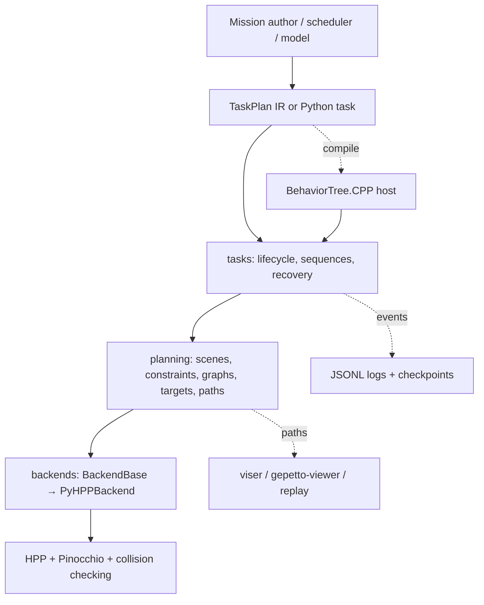
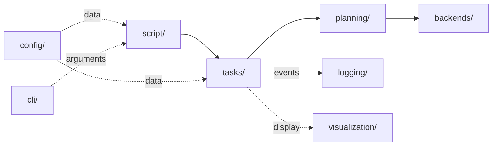
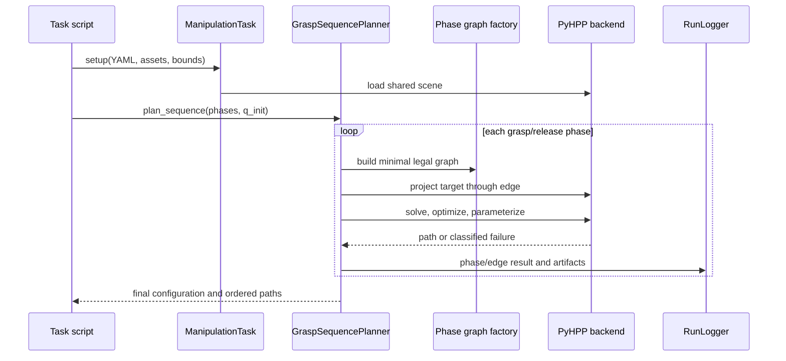

# System architecture

LongTAMP is the layer between a mission description and HPP’s geometric planner. It does not replace HPP’s sampling-based algorithms. It supplies scene composition, constraint construction, phase decomposition, target generation, bounded recovery, and evidence capture around them.

## Dependency boundaries

| Layer | Owns | Must not own |
| --- | --- | --- |
| `script/` | Robot assets, mission order, application policy | Reusable planner mechanics |
| `tasks/` | Lifecycle, phase sequencing, recovery, checkpoint coordination | Native HPP calls |
| `planning/` | Scene/constraint/graph builders, target projection, path capture | Robot-specific missions |
| `backends/` | HPP loading, solving, validation, path I/O | Mission policy |
| `config/` | YAML normalization and typed task data | Planner state |
| `logging/` | Stable event schema and serialization | Control flow |

Only `backends/` imports the native HPP interface. Pure-Python plan validation, compilation, configuration, and log inspection remain importable without native bindings.

## Runtime data flow

## Configuration model

YAML declares robots, fixed environments, free objects, grippers, handles, legal gripper-handle pairs, initial poses, joint bounds, and planner parameters. `YamlTaskLoader` turns this into file paths, a bounds class, and task configuration. Robot-specific values stay at the application boundary while builders consume a uniform shape.

The complete source-level architecture is maintained in [LongTAMP’s architecture reference](https://github.com/thanhndv212/long-tamp/blob/main/ARCHITECTURE.md).
