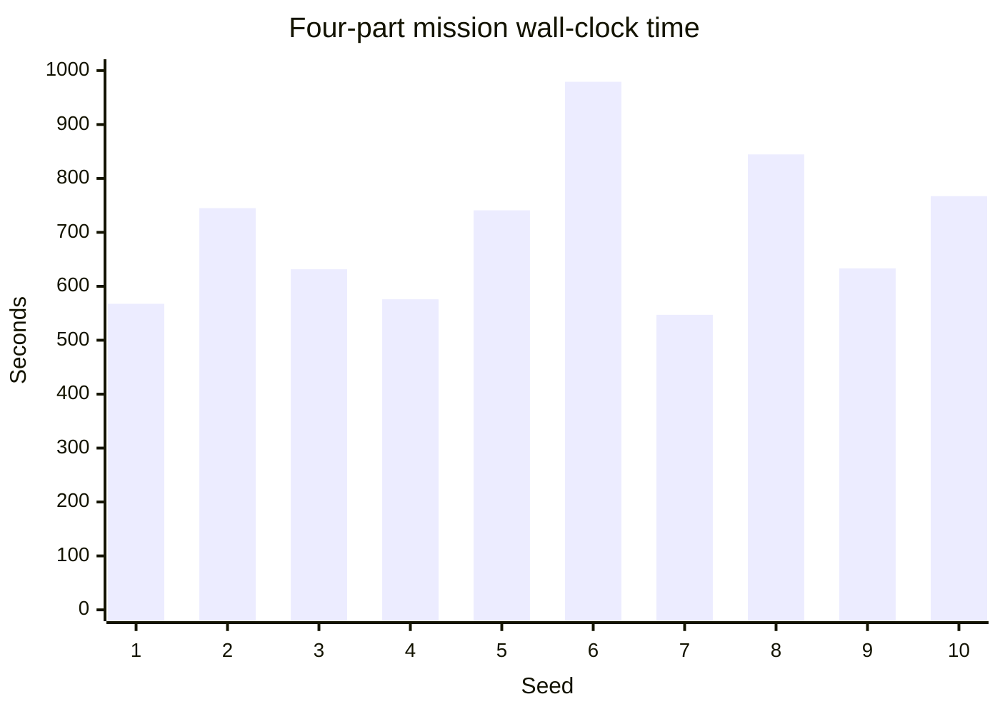

# Benchmarks and measured results

<strong>10 / 10</strong>four-part screw missions completed

<strong>687 s</strong>median planning time

<strong>13 / 13</strong>failure episodes recovered

<strong>0</strong>native crashes

## Four-part screw assembly

The current end-to-end dataset contains ten seeded runs on Linux aarch64, Python 3.11, stock PyPI HPP 9.0.2 wheels, Pinocchio 4.1.0, and NumPy 2.4.6. Three runs executed concurrently. Each mission contains 19 blocks, 31 grasp/release phases, and five home moves.

| Metric | Result | Interpretation |
| --- | ---: | --- |
| Missions completed | 10 / 10 | All seeds reached the terminal rack-driver block |
| Planning blocks | 140 | Excludes direct home moves |
| Blocks replanned from entry | 0 / 140 | Lookahead avoided irreversible commitments in this batch |
| Failure episodes recovered | 13 / 13 | All recovered through resume |
| Wall-clock time | 547.16–979.22 s | Includes planning, recovery, optimization, and logging |
| Median wall-clock time | 687.11 s | Roughly 11.5 minutes |
| Native crashes | 0 | For this ten-run dataset |

### Per-seed time

The time spread is dominated by path-verified lookahead: some seeds reject more clamp candidates before finding one that leaves both holes reachable. This benchmark measures planning in simulation against the configured collision and constraint model. It is not a physical assembly benchmark.

## Component measurements

| Mechanism | Baseline | Result | Scope |
| --- | ---: | ---: | --- |
| Sequence graph construction | O(N!) combinations | O(N) phase-local graphs | Algorithmic sequence scaling |
| 8×7 graph generation | over 20 min observed hang | seconds after upstream fix | Graph construction, not motion solve |
| Random sampling, 10k calls | CORBA 1.2 s | PyHPP 0.3 s | Historical microbenchmark |
| Configuration validation, 10k | CORBA 0.8 s | PyHPP 0.2 s | Historical microbenchmark |
| Path projection, 100 steps | CORBA 2.5 s | PyHPP 0.8 s | Historical microbenchmark |

The CORBA comparison comes from the predecessor engineering report and is retained as historical motivation. Current LongTAMP exposes PyHPP only; do not treat those numbers as a current cross-version benchmark.

## Reproducibility

The screw dataset is checked into the source repository as `script/screw_assembly/results/pypi-wheel-batch-2026-09-26.json` and identifies source commit `2117858`. Reproduce it with the example’s batch runner and compare completion, recovery, replanning, wall-clock distribution, and native crashes—not only a single successful replay.
