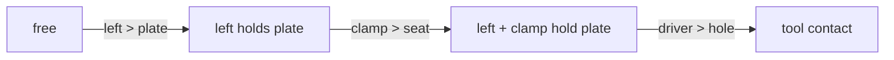

# Constraint graphs without the combinatorial blow-up

HPP manipulation expresses modes such as “free,” “pregrasp,” and “object held” as graph states. Edges apply constraints that project a configuration into the next mode. A general factory can enumerate every compatible grasp tuple, which is useful when the task is unknown but wasteful when the mission already specifies a sequence.

## Phase-local construction

For the sequence `left grasps plate → clamp holds plate → driver touches hole`, LongTAMP builds three small graphs instead of one graph containing every combination of arm, clamp, driver, plate, and hole.

`SequentialGraspFilter` admits only tuples consistent with the requested sequence. `SequentialConstraintGraphFactory` constructs the legal states and transitions for the active phase. `GraspStateTracker` carries the held-object state across graph boundaries.

This changes sequence-level graph construction from enumerating grasp permutations to building one bounded graph per phase: O(N!) to O(N) with respect to sequence length. It does not make an individual motion-planning query constant-time; collision geometry and narrow passages still determine solve cost.

## Upstream memoization defect

An 8-gripper × 7-handle production phase once spent more than 20 minutes inside graph generation. Investigation showed rejected combinations were revisited through different recursion orders. Adding an independent visited set preserved the graph while removing redundant traversal.

| Problem size | Recursive calls before | After fix |
| --- | ---: | ---: |
| 4 grippers × 3 handles | 222 | 73 |
| 6 × 5 | 137,266 | 4,051 |
| 7 × 6 | over 3,000,000; aborted | 37,633 |
| 8 × 7 | impractical | 394,353 |

These are recursion counts from a standalone reproduction, not end-to-end planning times. The generated states and transitions were checked for equality before and after the fix.

Read the [full defect analysis](https://github.com/thanhndv212/long-tamp/blob/main/docs/bugs/constraint-graph-factory-combinatorial-blowup.md).
