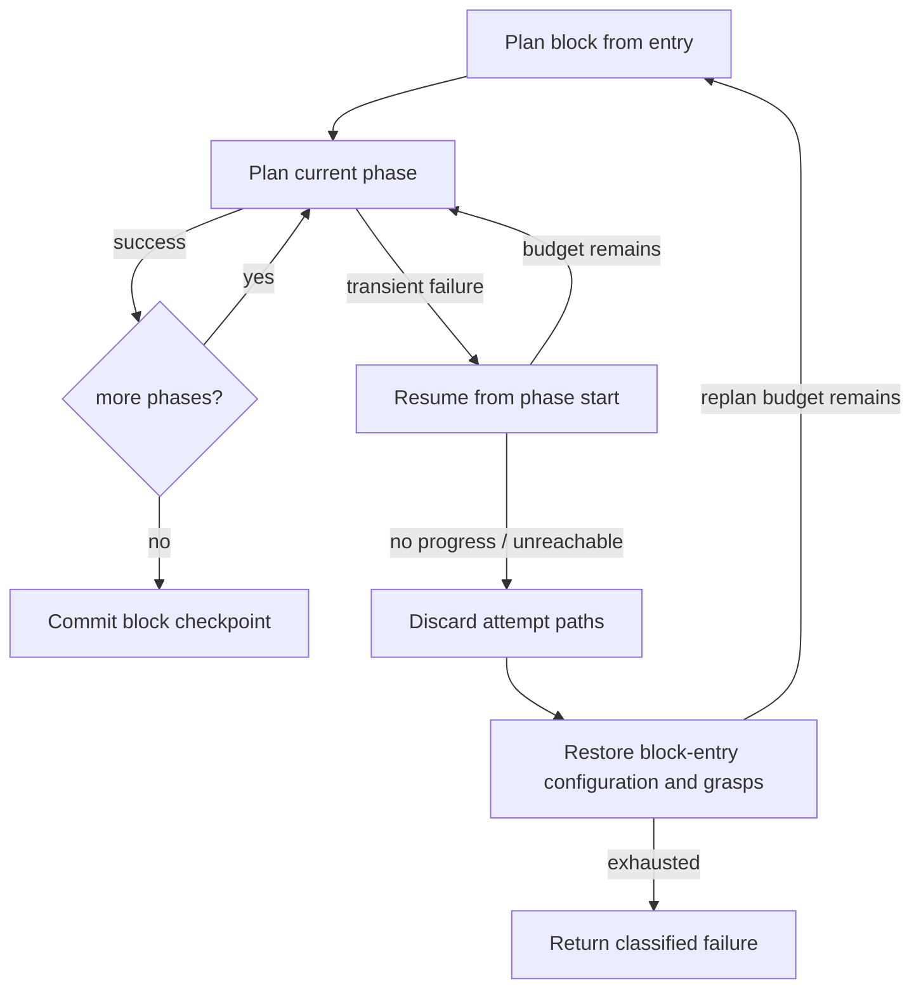

# Recovery and observability

Long-horizon planning fails differently from a single pick: an early feasible choice can make a later phase unreachable. LongTAMP treats this as control flow rather than an exception at the end of a monolithic solve.

## Recovery ladder

A resume retries the current phase from its valid start state. A replan throws away the incomplete attempt and starts the whole block from its entry so an earlier random choice can change. This distinction matters: retrying hole 2 cannot fix a clamp pose that geometrically blocks hole 2.

## Lookahead before commitment

`find_feasible_phase_target` can test whether a candidate for phase *i* still allows one or more future phase targets. Screw assembly uses it before committing a part to the clamp: the candidate must leave both screw holes reachable. This spends projection and path-checking time early to avoid a dead end several transitions later.

## Crash-safe artifacts

| Artifact | Purpose |
| --- | --- |
| `run_*.jsonl` | Append-only event stream for edges, phases, timings, configurations, errors |
| `mission.json` | Human-readable block outcomes and total mission state |
| `checkpoint.json` | Next block, configuration, and held grasp map |
| `trajectory.json` | Time-sampled replay independent of the planner process |
| `phases/` | Per-phase diagnostic dumps |

Checkpoint files are atomically replaced. Resume validates the last completed block’s label against the current mission definition, preventing a positional index from silently resuming into a changed plan.

## Evidence boundaries

A solver success proves that HPP produced a path satisfying its configured model and validators. It does not prove execution on hardware, perception robustness, grasp force, or task success in the physical world. Logs and replay are planning evidence; physical execution needs its own measurements.
