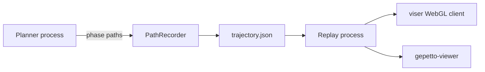

# Visualization and replay

LongTAMP supports browser-based `viser` and Qt-based `gepetto-viewer`. Visualization is deliberately downstream of planning: tasks can run headless in batch jobs, save paths, and replay them later in a lightweight process.



The screw-assembly replay samples time-parameterized paths at 20 Hz. It also animates gripper fingers at grasp and release boundaries because the planning model represents a grasp as a rigid frame constraint rather than simulating finger closure.

```bash
python script/screw_assembly/replay.py \
  script/screw_assembly/runs/<run>/trajectory.json --loop
```

Starting a live viewer while native planning runs can introduce backend-specific concurrency issues. The TWIN example therefore plans headless, starts the viewer after solving, and replays the completed path sequence.

## Recording media

The repository contains real scene captures but no checked-in MP4/WebM demonstration yet. A publishable example video should be generated from a pinned run artifact, state its seed and commit, and keep the original `mission.json` beside it. That makes the visual trace reproducible rather than an untraceable best-case clip.
