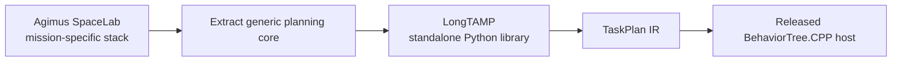

# From Agimus SpaceLab to LongTAMP

LongTAMP grew out of the generic planning core developed for Agimus SpaceLab, a multi-arm orbital assembly demonstrator. The extraction kept reusable planning mechanisms and removed the mission, proprietary executive, and SpaceLab-specific assets from LongTAMP’s history.

## What transferred

- phase-local constraint graphs for long manipulation sequences;
- composable scene, constraint, graph, and configuration builders;
- bounded planning, resume, abandoned-path trimming, and block replanning;
- the home-retreat policy for tools and arms sharing a tight workspace;
- structured logs, path capture, and replay;
- direct in-process PyHPP integration.

## What changed

SpaceLab’s mission used a proprietary dynamic behavior-tree engine and mission-specific ROS 2 wrappers. LongTAMP’s open route uses a versioned TaskPlan IR, a capability registry, deterministic BehaviorTree.CPP compilation, and an in-process CPython bridge. ROS 2 can consume LongTAMP, but it is not required by the library.

## Design lesson: retreat is part of planning

The predecessor mission showed that leaving a tool arm at the end of its last action can box in the second arm. Its screwdriving policy returned the tool arm home at deliberate boundaries. LongTAMP’s screw-assembly example applies the same principle: the right UR10 retreats home after picking the driver and after each plate, keeping the shared central workspace available for the left UR10.

This is application policy expressed through reusable planner operations. It belongs in the mission definition because geometric feasibility depends on where idle robots wait.

## Evidence and licensing boundary

SpaceLab validates the lineage and motivated many reliability features, but its mission results are not presented as LongTAMP benchmarks. The public screw-assembly cell was built independently from redistributable UR10/Robotiq assets, a CC BY 4.0 YCB drill scan, and generated primitive geometry.
