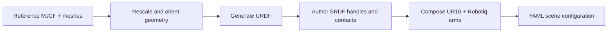

# IKEA table: real meshes and repeated docking

The IKEA LACK prototype uses two UR10 + Robotiq arms to pick four table legs and dock their pegs into sockets on a tabletop. It exercises an asset-heavy assembly scene rather than primitive-only collision geometry.


*Fresh viser capture after the generated URDF/SRDF scene passed its FK placement check, 27 September 2026.*

## Asset pipeline

The table and leg meshes come from the MIT-licensed `clvrai/furniture` dataset. The repository retains the reference MJCF and derives HPP-compatible URDF/SRDF assets through `build_assets.py`.



The generator preserves a reproducible route from third-party geometry to collision and semantic frames. `debug_view_frames.py` displays gripper, handle, and socket frames and checks the forward-kinematics placement before a planner run.

## Intended sequence

For each leg, one arm grasps the leg handle, moves the peg to its tabletop socket, transfers support to the socket constraint, and releases. Alternating arms allows the example to explore shared workspace use and accumulated collision geometry as the table becomes assembled.

## Current implementation status

The current scene loads successfully with 59 configuration DOF. FK checks place the tabletop and all four legs at their YAML targets. In the 27 September 2026 planning run, the phase-0 lookahead repeatedly failed to generate the future `leg1/peg > table/socket1_hole` target. Each five-second attempt ended in solver failure with no collision-invalid candidates; the smallest observed residual was approximately 0.0533. The run was stopped after repeated timeouts.

<div className="evidence-note"><strong>Status boundary.</strong> This is a prototype article. The scene and asset pipeline run, but the latest mission attempt did not pass the first peg/socket lookahead. There is no complete mission result, benchmark, or video to report yet.</div>

## Run the development tools

```bash
python script/ikea_table_prototype/build_assets.py --all
python script/ikea_table_prototype/debug_view_frames.py
python script/ikea_table_prototype/task_assemble_table.py
```

Before presenting this as a completed example, the project should pin a scene commit, complete all 12 phases, run a seeded batch, and publish per-phase success and timing alongside a replay artifact.
