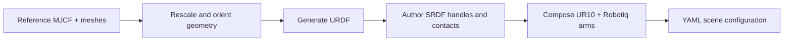

# IKEA table: real meshes and repeated docking

The IKEA LACK prototype uses two UR10 + Robotiq arms to pick four table legs and dock their pegs into sockets on a tabletop. It exercises an asset-heavy assembly scene rather than primitive-only collision geometry.

## Asset pipeline

The table and leg meshes come from the MIT-licensed `clvrai/furniture` dataset. The repository retains the reference MJCF and derives HPP-compatible URDF/SRDF assets through `build_assets.py`.



The generator preserves a reproducible route from third-party geometry to collision and semantic frames. `debug_view_frames.py` displays gripper, handle, and socket frames and checks the forward-kinematics placement before a planner run.

## Intended sequence

For each leg, one arm grasps the leg handle, moves the peg to its tabletop socket, transfers support to the socket constraint, and releases. Alternating arms allows the example to explore shared workspace use and accumulated collision geometry as the table becomes assembled.

## Current implementation status

Phase 1’s pregrasp target for `ur10_right/gripper > leg1/handle` converges reliably. The remaining eleven phases—docking and releasing leg 1, then repeating for legs 2–4—are still under development.

<div className="evidence-note"><strong>Status boundary.</strong> This is a prototype article. There is no complete mission result, benchmark, or video to report yet. The value today is the asset pipeline, scene semantics, frame-debugging workflow, and a reproducible first pregrasp.</div>

## Run the development tools

```bash
python script/ikea_table_prototype/build_assets.py --all
python script/ikea_table_prototype/debug_view_frames.py
python script/ikea_table_prototype/task_assemble_table.py
```

Before presenting this as a completed example, the project should pin a scene commit, complete all 12 phases, run a seeded batch, and publish per-phase success and timing alongside a replay artifact.
