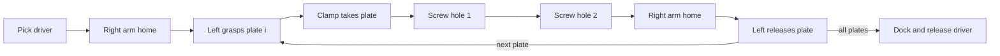

# Screw assembly: a complete long-horizon case study

Two UR10 arms with Robotiq 2F-85 grippers fasten four plates to a jig. The left arm transports and holds each plate. The right arm picks up a cordless driver, drives two holes per plate, retreats between parts, and finally returns the tool.

<div className="metric-row"><div className="metric"><strong>19</strong><span>mission blocks</span></div><div className="metric"><strong>31</strong><span>grasp/release phases</span></div><div className="metric"><strong>10 / 10</strong><span>seeded runs completed</span></div><div className="metric"><strong>687 s</strong><span>median planning time</span></div></div>

<div className="figure-grid">
  <figure><figcaption>Fresh capture from the seed-10 recorded trajectory, replayed on 27 September 2026 at the final assembled state.</figcaption></figure>
  <figure><figcaption>Initial cell: two opposed UR10s, staged plates, jig, and docked driver.</figcaption></figure>
  <figure><figcaption>The planning model after grasping: held objects become rigidly constrained to gripper frames.</figcaption></figure>
  <figure><figcaption>Four-part assembly during the repeated clamp-and-screw cycle.</figcaption></figure>
  <figure><figcaption>Final planned configuration with all four plates retained by fixture clamps.</figcaption></figure>
</div>

The scene was loaded again on 27 September 2026 with `--check`: 59 configuration DOF, four parts, and a valid initial configuration. The new lead image is a fresh viser capture of the stored seed-10 trajectory’s terminal configuration.

## Scene semantics

| Entity | Model | Planning frames |
| --- | --- | --- |
| `ur10_left`, `ur10_right` | UR10 + Robotiq, on 0.6 m pedestals | `gripper` |
| `fixtures` | Fixed zero-joint robot containing jig and dock | `clamp1..4`, `rack_hold` |
| `part1..4` | 0.30 × 0.06 × 0.02 m plates | `h_grasp`, `h_seat`, `h_hole1`, `h_hole2` |
| `driver` | YCB power-drill visual with fitted collision proxies and 50 mm bit | `h_grip`, `h_rack`, `tip` |

The fixture is modeled as a robot because an HPP gripper can hold an object while an object handle cannot hold another object. The driver tip is also a gripper, allowing screw contact to use the same grasp-state machinery as robot hands and clamps.

## Mission decomposition

For `N` plates, the mission contains `4N + 3` blocks, `7N + 3` grasp/release phases, and `N + 1` explicit home moves.



The Python mission builder generates these blocks from the requested part count. A per-phase frozen-arm map says which robot may move: the left arm carries the plate into the clamp; the right arm moves during screw phases; the non-active arm stays fixed.

## Why the clamp phase is difficult

The clamp transition fixes the left arm’s posture around the plate. That posture can make hole 2 unreachable by the driver even when clamping and hole 1 are individually feasible. Retrying hole 2 cannot change the earlier clamp choice.

LongTAMP uses a lookahead on phase 0 that tests candidate clamp configurations against both future screw phases before committing. If a later failure still occurs, `run_block_with_recovery` resumes the failing phase and eventually replans the full block from its entry.

```python
{
    "label": f"{part} A: clamp + screw",
    "seq": [
        (f"fixtures/clamp{i}", f"{part}/h_seat"),
        ("driver/tip", f"{part}/h_hole1"),
        ("driver/tip", None),
        ("driver/tip", f"{part}/h_hole2"),
        ("driver/tip", None),
    ],
    "lookahead": {"pair": (0, 1), "also": (3,)},
}
```

## Home-retreat policy

An earlier version left the right arm where it finished. That broke the hint chain fifteen times and produced 45 failed resumes when the arms interfered near the center of the cell. The final mission explicitly sends the driver arm home after pickup and after each plate. This policy was inherited as a lesson from Agimus SpaceLab’s tighter screwdriving cell.

## Run and resume

```bash
python script/screw_assembly/build_scene.py --parts 4
python script/screw_assembly/task_screw_assembly.py --check
python script/screw_assembly/task_screw_assembly.py --seed 1
python script/screw_assembly/task_screw_assembly.py \
  --seed 1 --run-dir script/screw_assembly/runs/<run> --resume
python script/screw_assembly/replay.py \
  script/screw_assembly/runs/<run>/trajectory.json --loop
```

Every completed block atomically updates the checkpoint and sampled trajectory. Resume restores both the full configuration and the map of grippers to held handles.

## Results

Ten seeds were run with stock PyPI HPP 9.0.2 wheels inside the Linux aarch64 project container, three processes at a time.

| Outcome | Measurement |
| --- | ---: |
| Complete missions | 10 / 10 |
| Median time | 687.11 s |
| Range | 547.16–979.22 s |
| Failure episodes recovered | 13 / 13 |
| Blocks requiring replan from entry | 0 / 140 planning blocks |
| Native crashes | 0 |

All failure episodes recovered through phase resume; none reached the replan-from-entry tier in this batch. The full per-seed data and dependency versions are in the [source result file](https://github.com/thanhndv212/long-tamp/blob/main/script/screw_assembly/results/pypi-wheel-batch-2026-09-26.json).

<div className="evidence-note"><strong>What this proves.</strong> The configured planning problem completed for ten deterministic random seeds and produced replayable paths. It does not demonstrate physical fastening, torque control, visual pose estimation, or hardware execution.</div>

## Video status

The replay path is implemented and reproducible, but the repository does not yet include a checked-in public video. Recordings should be generated from a named run directory and published with its seed, commit, `mission.json`, and trajectory so the clip remains tied to inspectable evidence.
