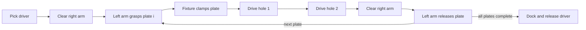
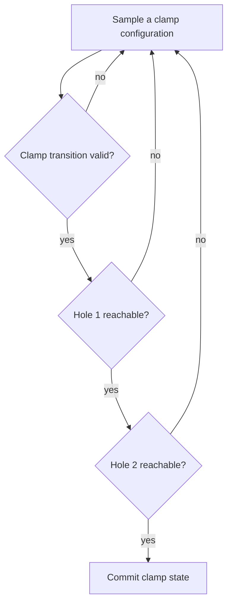
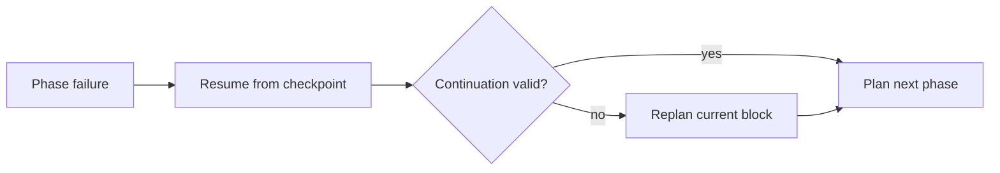

# Screw assembly: a complete long-horizon case study

Two UR10 arms assemble four plates in a shared workcell. The left arm supplies and locates a plate; the right arm carries a cordless driver and fastens two holes. LongTAMP treats this as one stateful mission: attachments, collision geometry, feasible postures, and the growing assembly are carried from one phase to the next.

<strong>19</strong>mission blocks

<strong>31</strong>grasp/release phases

<strong>10 / 10</strong>completed trials

<strong>687 s</strong>median planning time

## Full mission replay

<video controls preload="metadata" poster="/long-tamp-webpage/img/examples/screw-assembly/replay/scene-overview.jpg" style={{width: '100%', borderRadius: '12px'}}>
  <source src="/long-tamp-webpage/video/screw-assembly-full-demo.mp4" type="video/mp4" />
</video>

*The complete four-plate mission at recorded timing. It begins from the validated task configuration, then preserves the recorded block order through driver return.*

## Scene semantics

The scene is intentionally modeled as a small factory rather than as a sequence of independent pick-and-place problems. Handles name the task-relevant frames at which attachments can change; collision geometry remains active as plates move from the rack into the fixture.

| Entity | Role in the scene | Planning frames |
| --- | --- | --- |
| `ur10_left`, `ur10_right` | UR10 manipulators with Robotiq grippers, mounted on opposed pedestals | `gripper` |
| `fixtures` | Static fixture, plate clamps, staging rack, and driver dock | `clamp1..4`, `rack_hold` |
| `part1..4` | Plates transferred from the rack and retained by the fixture | `h_grasp`, `h_seat`, `h_hole1`, `h_hole2` |
| `driver` | Hand-held fastening tool, initially held by the dock | `h_grip`, `h_rack`, `tip` |

The fixture is represented as an immobile robot so that its clamps can take ownership of a plate. The driver tip is represented as a gripper, which lets tool contact use the same attachment and transition machinery as a robot hand.

## What the replay shows

  <figure><figcaption><strong>1 — Acquire the driver.</strong> The right arm closes on the docked tool before moving it through the shared workspace.</figcaption></figure>
  <figure><figcaption><strong>2 — Acquire a plate.</strong> The left gripper takes the next plate from the rack while the driver remains attached to the right arm.</figcaption></figure>
  <figure><figcaption><strong>3 — Clamp and fasten.</strong> The fixture holds the plate while the driver reaches the first fastening frame.</figcaption></figure>
  <figure><figcaption><strong>4 — Advance the assembly.</strong> A completed plate stays in the fixture, changing the collision scene for the next cycle.</figcaption></figure>
  <figure><figcaption><strong>5 — Commit the final plate.</strong> The last clamp transfer leaves a progressively more constrained central workspace.</figcaption></figure>
  <figure><figcaption><strong>6 — Clear and return.</strong> The arms leave the fixture clear and the driver returns to its dock.</figcaption></figure>

## Mission structure

For each plate, the planner builds a five-stage transfer-and-fastening sequence. The resulting state becomes the entry state of the following sequence, so a locally feasible phase is insufficient if it prevents a later driver approach.

The active gripper defines the attachment transition at each step. A frozen-arm policy keeps the inactive arm stable during single-arm phases, reducing the search space and protecting the partner arm's clearance around the fixture.

## Why clamp selection needs lookahead

The clamp transfer fixes the plate and the left arm's posture before either screw is driven. A pose that allows the clamp and the first hole can still block the second hole, because the driver approaches from a different direction and must avoid both robots, the fixture, and completed plates.

LongTAMP therefore evaluates clamp candidates against later contact phases before committing them. Candidate configurations that make either driver target unreachable are rejected at the decision point where the planner can still choose a different clamp pose.

## Stateful recovery

Every completed phase updates the mission state: configuration, active attachments, and sampled path data. If a later phase fails, recovery first resumes from the last completed phase. Only when that cannot restore a valid continuation does the planner rebuild the enclosing block from its entry state.

This distinction matters in long missions: a late approach failure should not discard attachments and collision commitments that were already established successfully.

## Results and limits

The recorded benchmark completed all ten deterministic trials. Median planning time was 687 seconds, with 13 failure episodes recovered by phase-level resume and no native crashes. The evidence demonstrates collision-aware planning and replayable simulated motion for the configured scene. It does not measure physical fastening, torque control, perception, calibration error, or hardware execution.
