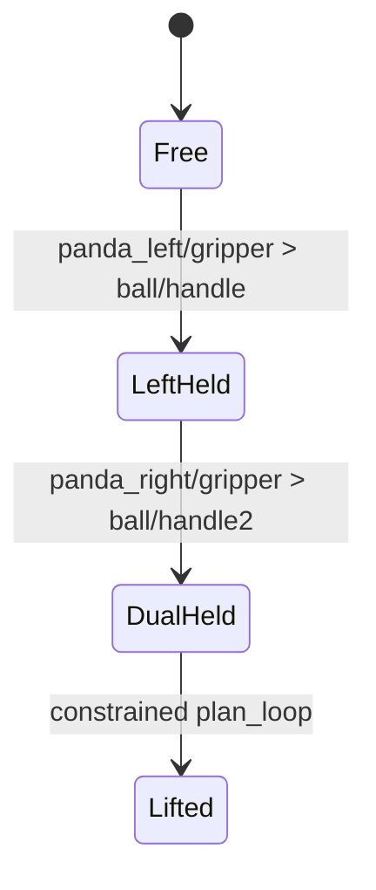

# TWIN lift ball: closed-chain bimanual motion

This example adapts the TWIN/PerAct2 “lift ball” task to two Franka Panda arms. Each arm grasps a distinct handle on the same ball; the pair then raises it while both rigid grasp constraints remain active.

## Planning problem



The model has two independent seven-axis arms with articulated two-joint grippers and one free-flying ball. Finger joints remain fixed at a useful rendered width because grasp closure is represented by a rigid TCP constraint.

## Why moving the ball directly fails

After both grasps activate, the ball pose is dependent on both arm configurations. Adding 10 cm to the ball’s free-flyer Z value creates an inconsistent guess; projection can return the ball to the same constrained pose with zero motion.

The implementation perturbs both arms’ `panda_joint2`, projects that guess onto the active dual-grasp node, and keeps the direction that raises the ball. It repeats in small steps because a single large projection may not converge and because the useful joint sign depends on the sampled elbow configuration.

```python
for sign in (1, -1):
    q_guess[left_joint] += sign * step
    q_guess[right_joint] += sign * step
    ok, q_projected = config_gen.project_on_node(node, q_guess)
    if ok and ball_z(q_projected) > ball_z(q_current):
        keep(q_projected)
```

The resulting configuration already satisfies both grasps. `plan_loop` then searches for a collision-free path inside that constrained state.

## Execution

```bash
python script/twin/task_lift_ball.py --backend pyhpp
python script/twin/task_lift_ball.py --backend pyhpp --viewer
```

Planning completes before the viser server starts. This ordering avoids a reproduced native concurrency failure when WebSocket visualization and the RRT/collision checker ran simultaneously.

## Results and limitations

The implementation reports the two grasp phases independently from the final constrained lift, so a failed lift does not erase evidence that the dual grasp was found. The source currently contains no pinned multi-seed result set, timing distribution, or public replay media. Accordingly, this example demonstrates the method and integration surface; it is not yet a benchmark claim.

A complete evaluation should record grasp success, achieved vertical displacement, closed-chain planning time, path length, minimum collision clearance, and failure classification across fixed seeds.
